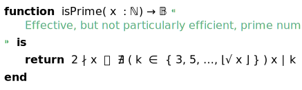

# 

The choice of the right font is crucial for readability and understanding in many fields, especially for the precise representation of program code and scientific formulas. Just as TeX has become indispensable for typesetting formulas in science, the use of a specially designed font for displaying code and mathematical expressions is equally critical.

For program code, a clearly readable font that ensures a good distinction between characters is essential to avoid errors and to intuitively grasp the structure of the code. Especially in more complex programs, sans-serif fonts can lead to confusion, as the visual differences between characters like “1” and “l” or “O” and “0” are difficult to discern. Serif fonts, on the other hand, provide better readability through their additional strokes, helping to make these distinctions clearer and quicker to identify.

# 

Similarly, in mathematical expressions and formulas, where precise representation of symbols and characters is crucial, a specially designed font like Aalfons ensures that mathematical symbols, operators, and numbers are displayed exactly as required by scientific notation. This guarantees not only a clear visual representation but also the correct interpretation of the formulas by the reader.

Therefore, the choice of the right font is not just a matter of aesthetics, but a fundamental requirement to ensure clarity and precision in technical and scientific fields. By using a font specifically tailored to the needs of programming and formula typesetting, the reading flow is improved, and the accuracy of interpretation is significantly enhanced.

# The Aalfons Font Family

The Aalfons font family is based on the STIX font family and provides a range of fonts that enable the representation of all Aalgola sources. In addition to the standard font variants such as _bold_, _italic_, and _bold-italic_, there are fonts that allow for special representations of certain text fragments. For example, there is a font in which the letters used for hexadecimal digits are rendered identically to the decimal digits.

## The STIX Font Family

In the mid-1990s, Arie de Ruiter, then head of the Information Technology Development department at Elsevier Science, in the STI Pub group—a loose coalition of representatives from the American Chemical Society (ACS), the American Institute of Physics (AIP), the American Mathematical Society (AMS), the American Physical Society (APS), Elsevier, and the Institute of Electrical and Electronics Engineers (IEEE)—proposed the development of a set of web fonts. These Unicode-based fonts were intended to include all alphabets, symbols, and characters commonly used in scientific papers. Furthermore, these fonts were to be made freely available worldwide to scientists, students, and all interested parties.

De Ruiter proposed naming these fonts "Scientific and Technical Information eXchange Fonts," or more simply, "STIX Fonts." The release of the STIX Fonts allowed de Ruiter's vision to be realized, without which the programming language Aalgola would not have been possible.

## Aalfons’ Extensions

Building upon the STIX Fonts, the Aalfons font family is now being implemented. Essentially, this involves additions that either encode or display existing characters differently.

### Display Variants

As mentioned earlier, certain characters are offered in mono-spaced variants. This allows, for example, the correct alignment of columns for _b_-adic numbers as well as decimal numbers. This applies equally to the representation of hexadecimal numbers, bit patterns, and the embedding of Base-64 and similarly encoded data, which require the entire ASCII character set.

### Encoding Variants

In Aalgola, all variables are automatically rendered in italics, which makes the italicized Unicode letters redundant. However, upright letters are necessary for the representation of units. Therefore, in Aalfons, the letters of the Latin alphabet are redefined so that they cannot be confused with the standard italicized letters, either visually or in encoding.

    ¶ Unit of measurement. 
    <i>m</i> :← 3 m                       
    ¶ Complex number. 
    <i>c</i> :← <i>a</i> + <i>b</i> i 

### Additions

To ensure that Aalgola sources can also be used in simple Unicode editors, all control characters used in Aalgola are represented as (invisible) characters. Furthermore, particularly any character combinations that have not yet been defined in the STIX font are supplemented.

Special mention should be made of the “Double-A”, which allows (brand) names like Aalgola to be displayed correctly.

## Usage Conditions

This is made possible by the generous licensing terms of the STIX Fonts, which allow for nearly unrestricted redistribution. The underlying SIL Open Font License not only governs the use of the STIX Fonts but also ensures that the Aalfons font family can be used and redistributed under the same conditions, even outside the Aalgola universe.
